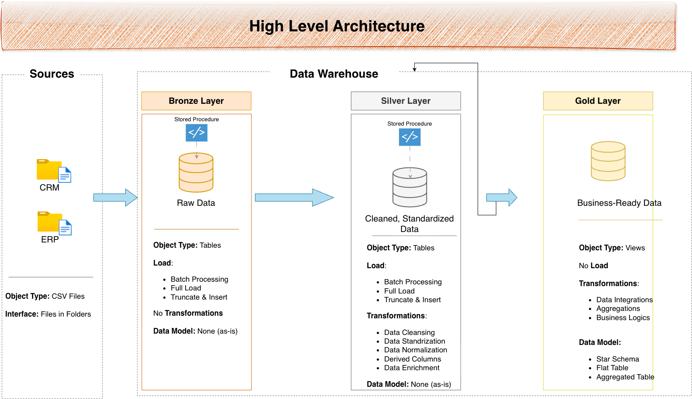
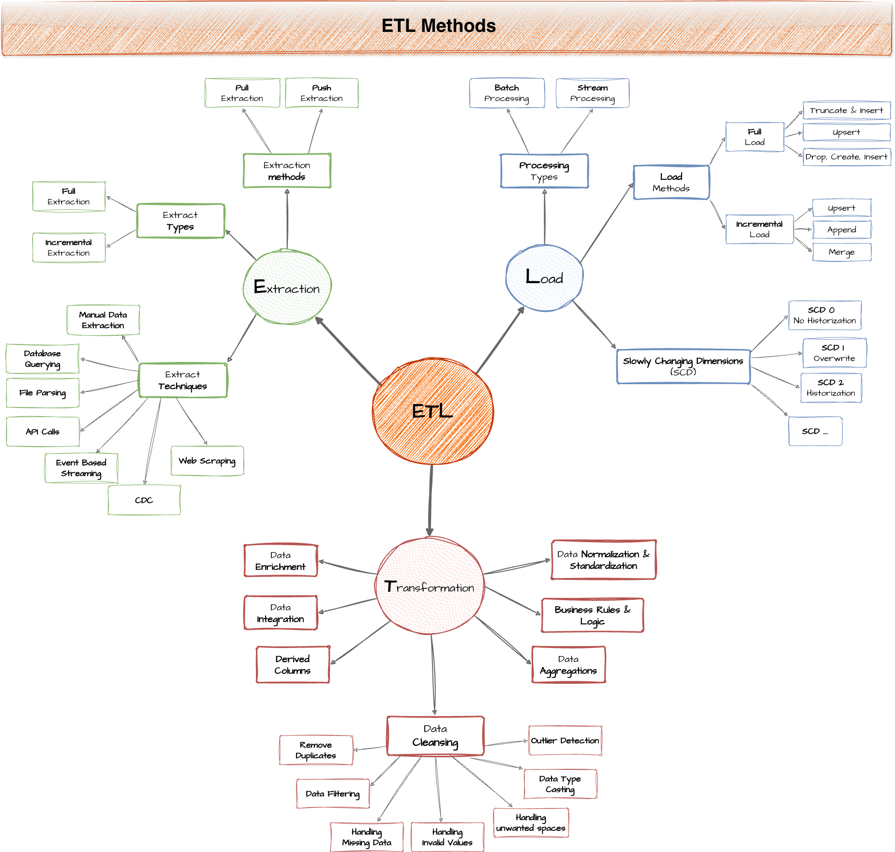
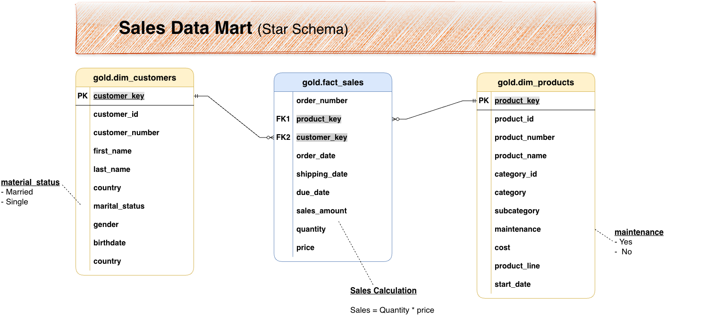
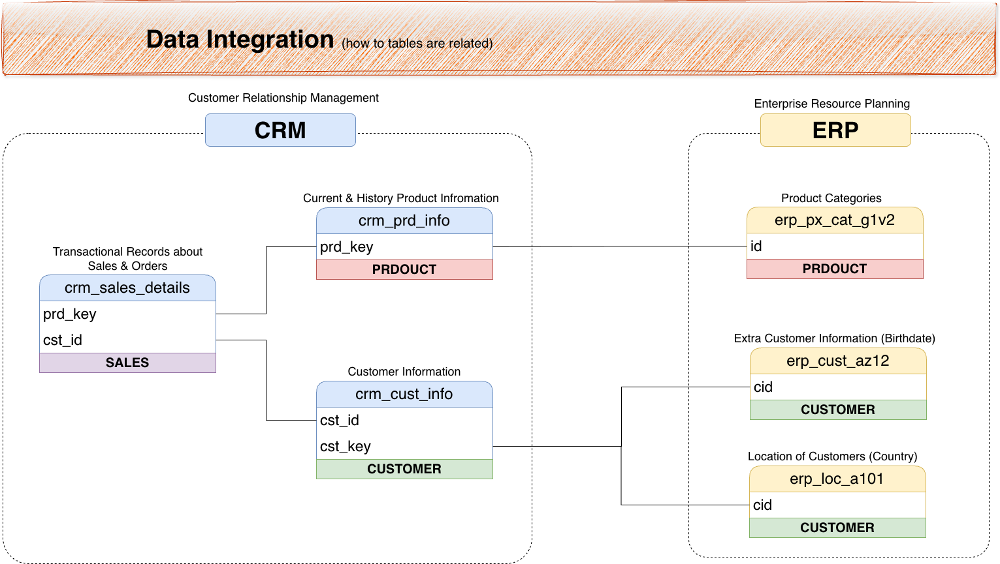

<div align="center">

# 🚀 InsightFlow

### Enterprise Data Warehouse Solution with ETL Pipeline & Analytics


<br>
<br>

### 🔗 [**View Live Dashboard →**](https://insightflow-dashboard-sage.vercel.app/)

<br>


**A modern Data Warehouse implementation using the Medallion Architecture (Bronze → Silver → Gold) with PostgreSQL**

[📊 Architecture](#-data-architecture) • [🔄 ETL Pipeline](#-etl-pipeline) • [⭐ Star Schema](#-star-schema-gold-layer) • [🧪 Quality Checks](#-data-quality-framework) • [🚀 Get Started](#-getting-started)

</div>

---

## 📌 Executive Summary

**InsightFlow** is a comprehensive data warehouse project that demonstrates end-to-end data engineering practices including:

- 🏗️ **Medallion Architecture** (Bronze/Silver/Gold layers)
- 🔄 **ETL Pipeline Development** with stored procedures
- 📊 **Star Schema Design** for analytics
- 🧪 **Data Quality Framework** with validation checks
- 📈 **Business Intelligence Ready** dimensional model

<div align="center">

| Component | Description |
|:---------:|-------------|
| 📁 **6 Source Tables** | CRM (3) + ERP (3) integration |
| 🥉 **Bronze Layer** | Raw data ingestion |
| 🥈 **Silver Layer** | Cleansed & standardized data |
| 🥇 **Gold Layer** | Star schema for analytics |
| 🧪 **Quality Checks** | Data validation framework |

</div>

---

## 🏛️ Data Architecture

The project follows the **Medallion Architecture** pattern, a data design pattern used to logically organize data in a lakehouse with the goal of incrementally improving data quality.

<div align="center">



</div>

### Architecture Layers

```
┌─────────────────────────────────────────────────────────────────────────────┐
│                           INSIGHTFLOW DATA WAREHOUSE                        │
├─────────────────────────────────────────────────────────────────────────────┤
│                                                                             │
│   📁 SOURCE SYSTEMS          🥉 BRONZE              🥈 SILVER              │
│   ─────────────────          ───────────           ──────────              │
│                                                                             │
│   ┌─────────────┐           ┌──────────┐          ┌──────────┐             │
│   │  CRM DATA   │ ────────▶ │   RAW    │ ───────▶ │ CLEANSED │             │
│   │  • Customers│           │   DATA   │          │   DATA   │             │
│   │  • Products │           │          │          │          │             │
│   │  • Sales    │           │ As-Is    │          │ Validated│             │
│   └─────────────┘           │ Ingestion│          │ Standard │             │
│                             └──────────┘          └────┬─────┘             │
│   ┌─────────────┐                                      │                   │
│   │  ERP DATA   │ ────────▶      ▼                     ▼                   │
│   │  • Location │                                                          │
│   │  • Customer │           🥇 GOLD LAYER                                  │
│   │  • Category │           ─────────────                                  │
│   └─────────────┘           ┌──────────────────────────────────┐           │
│                             │         STAR SCHEMA              │           │
│                             │  ┌──────────┐  ┌──────────┐     │           │
│                             │  │   DIM    │  │   DIM    │     │           │
│                             │  │CUSTOMERS │  │ PRODUCTS │     │           │
│                             │  └────┬─────┘  └────┬─────┘     │           │
│                             │       │             │            │           │
│                             │       └──────┬──────┘            │           │
│                             │              ▼                   │           │
│                             │       ┌──────────┐              │           │
│                             │       │   FACT   │              │           │
│                             │       │  SALES   │              │           │
│                             │       └──────────┘              │           │
│                             └──────────────────────────────────┘           │
│                                                                             │
└─────────────────────────────────────────────────────────────────────────────┘
```

---

## 🔄 ETL Pipeline

The ETL (Extract, Transform, Load) process is implemented using PostgreSQL stored procedures for reliability and repeatability.

<div align="center">



</div>

### Pipeline Stages

#### 🥉 Bronze Layer: Raw Data Ingestion

```sql
-- Stored Procedure: bronze.load_bronze()
-- Loads raw CSV data from CRM and ERP systems
CALL bronze.load_bronze();
```

**What it does:**
- ✅ Truncates existing bronze tables
- ✅ Bulk loads data from CSV files
- ✅ Logs execution time per table
- ✅ Error handling with detailed messages

**Tables Created:**
| Source | Table | Description |
|--------|-------|-------------|
| CRM | `bronze.crm_cust_info` | Customer master data |
| CRM | `bronze.crm_prd_info` | Product catalog |
| CRM | `bronze.crm_sales_details` | Sales transactions |
| ERP | `bronze.erp_cust_az12` | Customer demographics |
| ERP | `bronze.erp_loc_a101` | Location/Country data |
| ERP | `bronze.erp_px_cat_g1v2` | Product categories |

---

#### 🥈 Silver Layer: Data Cleansing & Transformation

```sql
-- Stored Procedure: silver.load_silver()
-- Cleanses and standardizes data for analytics
CALL silver.load_silver();
```

**Transformations Applied:**

| Transformation | Description | Example |
|----------------|-------------|---------|
| **Deduplication** | Keeps latest record per key | `ROW_NUMBER() OVER (PARTITION BY...)` |
| **Standardization** | Codes → Readable values | `'M' → 'Male'`, `'S' → 'Single'` |
| **Null Handling** | Replace nulls with defaults | `COALESCE(cost, 0)` |
| **Trimming** | Remove unwanted spaces | `TRIM(cst_firstname)` |
| **Date Fixing** | Correct invalid date ranges | `LEAD()` for end dates |
| **Business Rules** | Apply domain logic | Product line expansion |

**Example: Customer Standardization**
```sql
CASE
    WHEN UPPER(TRIM(cst_gndr)) = 'F' THEN 'Female'
    WHEN UPPER(TRIM(cst_gndr)) = 'M' THEN 'Male'
    ELSE 'n/a'
END AS gender
```

---

#### 🥇 Gold Layer: Star Schema for Analytics

The Gold layer presents data as a **Star Schema** optimized for business intelligence and analytics.

<div align="center">



</div>

---

## ⭐ Star Schema (Gold Layer)

### Dimension: `gold.dim_customers`

| Column | Type | Description |
|--------|------|-------------|
| `customer_key` | INT | Surrogate key (auto-generated) |
| `customer_id` | INT | Business key from CRM |
| `customer_number` | VARCHAR | Customer reference number |
| `first_name` | VARCHAR | Customer first name |
| `last_name` | VARCHAR | Customer last name |
| `marital_status` | VARCHAR | Single / Married / n/a |
| `gender` | VARCHAR | Male / Female / n/a |
| `birth_date` | DATE | From ERP system |
| `country` | VARCHAR | Customer location |
| `create_date` | DATE | Account creation date |

### Dimension: `gold.dim_products`

| Column | Type | Description |
|--------|------|-------------|
| `product_key` | INT | Surrogate key |
| `product_id` | INT | Business key |
| `product_number` | VARCHAR | Product SKU |
| `product_name` | VARCHAR | Product description |
| `category` | VARCHAR | Main category |
| `subcategory` | VARCHAR | Sub category |
| `product_line` | VARCHAR | Mountain / Road / Touring / Other |
| `cost` | INT | Product cost |
| `maintenance` | VARCHAR | Maintenance type |
| `start_date` | DATE | Product availability date |

### Fact: `gold.fact_sales`

| Column | Type | Description |
|--------|------|-------------|
| `order_number` | VARCHAR | Sales order ID |
| `product_key` | INT | FK → dim_products |
| `customer_key` | INT | FK → dim_customers |
| `order_date` | DATE | Order placement date |
| `shipping_date` | DATE | Shipment date |
| `due_date` | DATE | Expected delivery |
| `sales_amount` | INT | Total sale value |
| `quantity` | INT | Units sold |
| `price` | INT | Unit price |

---

## 📊 Data Flow

<div align="center">


</div>

---

## 🔗 Data Integration

The project integrates data from multiple source systems (CRM and ERP) into a unified data model.

<div align="center">



</div>

### Integration Strategy

```
┌─────────────────────────────────────────────────────────────────────┐
│                      DATA INTEGRATION                               │
├─────────────────────────────────────────────────────────────────────┤
│                                                                     │
│   CRM SYSTEM                        ERP SYSTEM                      │
│   ──────────                        ──────────                      │
│   ┌──────────────┐                  ┌──────────────┐               │
│   │ cust_info    │◄─── cst_key ────►│ CUST_AZ12    │               │
│   │ prd_info     │◄─── cat_id  ────►│ PX_CAT_G1V2  │               │
│   │ sales_details│                  │ LOC_A101     │               │
│   └──────────────┘                  └──────────────┘               │
│                                                                     │
│   Integration Keys:                                                 │
│   • Customer: cst_key ↔ cid                                        │
│   • Product: cat_id ↔ id                                           │
│   • Location: cst_key ↔ cid                                        │
│                                                                     │
└─────────────────────────────────────────────────────────────────────┘
```

---

## 🧪 Data Quality Framework

Comprehensive quality checks are implemented at each layer to ensure data integrity.

### Silver Layer Quality Checks

| Check Type | Description | Expectation |
|------------|-------------|-------------|
| **Primary Key** | No NULLs or duplicates | Zero results |
| **Whitespace** | No leading/trailing spaces | Zero results |
| **Standardization** | Consistent codes | Valid values only |
| **Date Validity** | Logical date ranges | Start ≤ End |
| **Calculations** | Sales = Qty × Price | Zero mismatches |
| **Range Checks** | Birthdates within range | 1924 to today |

### Gold Layer Quality Checks

| Check Type | Description | Expectation |
|------------|-------------|-------------|
| **Surrogate Keys** | Unique customer_key | Zero duplicates |
| **Surrogate Keys** | Unique product_key | Zero duplicates |
| **Referential Integrity** | All FKs resolve | Zero orphans |
| **Model Connectivity** | Fact ↔ Dimensions | Complete joins |

**Example Quality Check:**
```sql
-- Check for orphaned fact records
SELECT * 
FROM gold.fact_sales f
LEFT JOIN gold.dim_customers c ON c.customer_key = f.customer_key
LEFT JOIN gold.dim_products p ON p.product_key = f.product_key
WHERE p.product_key IS NULL OR c.customer_key IS NULL;
-- Expectation: No results
```

---

## 📁 Project Structure

```
InsightFlow/
│
├── 📁 Dataset/
│   ├── 📂 CRM_DATA/
│   │   ├── cust_info.csv           # Customer master
│   │   ├── prd_info.csv            # Product catalog
│   │   └── sales_details.csv       # Sales transactions
│   │
│   └── 📂 ERP_DATA/
│       ├── CUST_AZ12.csv           # Customer demographics
│       ├── LOC_A101.csv            # Location data
│       └── PX_CAT_G1V2.csv         # Product categories
│
├── 📁 Scripts/
│   ├── dbinit.sql                  # Database & schema creation
│   ├── Bronze_layer                # Raw data ingestion procedure
│   ├── Sliver_Layer_table_creation # Silver table DDL
│   ├── Silver_Layer                # Data cleansing ETL
│   └── Gold_Layer                  # Star schema views
│
├── 📁 Tests/
│   ├── Slver_layer_qc              # Silver layer quality checks
│   └── Gold_layer_qc               # Gold layer quality checks
│
├── 📁 Docs/
│   ├── data_architecture.png       # Architecture diagram
│   ├── ETL.png                     # ETL process flow
│   ├── data_model.png              # Star schema diagram
│   ├── data_integration.png        # Integration mapping
│   └── DATA_Flow_.drawio.png       # Data flow diagram
│
├── LICENSE
└── README.md
```

---

## 🚀 Getting Started

### Prerequisites

- **PostgreSQL 12+** installed
- Database client (pgAdmin, DBeaver, or psql)
- Git

### Installation

```bash
# 1. Clone the repository
git clone https://github.com/rahulx2001/InsightFlow.git
cd InsightFlow

# 2. Create database and schemas
psql -U postgres -f Scripts/dbinit.sql

# 3. Connect to the database
psql -U postgres -d datawarehouse
```

### Running the ETL Pipeline

```sql
-- Step 1: Create Bronze tables and load raw data
-- (Run Bronze_layer script first to create tables)
CALL bronze.load_bronze();

-- Step 2: Create Silver tables and load cleansed data
-- (Run Sliver_Layer_table_creation first)
CALL silver.load_silver();

-- Step 3: Create Gold layer views
-- (Run Gold_Layer script to create star schema)

-- Step 4: Run quality checks
-- (Execute tests from Tests folder)
```

### Verify Installation

```sql
-- Check Bronze layer
SELECT COUNT(*) FROM bronze.crm_cust_info;

-- Check Silver layer
SELECT COUNT(*) FROM silver.crm_cust_info;

-- Check Gold layer
SELECT * FROM gold.dim_customers LIMIT 5;
SELECT * FROM gold.fact_sales LIMIT 5;
```

---

## 📊 Sample Analytics Queries

```sql
-- Total Sales by Customer Country
SELECT 
    c.country,
    COUNT(f.order_number) AS total_orders,
    SUM(f.sales_amount) AS total_revenue
FROM gold.fact_sales f
JOIN gold.dim_customers c ON f.customer_key = c.customer_key
GROUP BY c.country
ORDER BY total_revenue DESC;

-- Product Performance by Category
SELECT 
    p.category,
    p.subcategory,
    SUM(f.quantity) AS units_sold,
    SUM(f.sales_amount) AS revenue
FROM gold.fact_sales f
JOIN gold.dim_products p ON f.product_key = p.product_key
GROUP BY p.category, p.subcategory
ORDER BY revenue DESC;

-- Monthly Sales Trend
SELECT 
    DATE_TRUNC('month', f.order_date) AS month,
    COUNT(*) AS orders,
    SUM(f.sales_amount) AS revenue
FROM gold.fact_sales f
GROUP BY DATE_TRUNC('month', f.order_date)
ORDER BY month;
```

---

## 🛠️ Technical Stack

<div align="center">

| Technology | Purpose |
|:----------:|---------|
|  | Data Warehouse Database |
|  | ETL & Data Modeling |
|  | Architecture Diagrams |
|  | Version Control |

</div>

---

## 📚 Key Concepts Demonstrated

| Concept | Implementation |
|---------|----------------|
| **Medallion Architecture** | Bronze → Silver → Gold layers |
| **ETL Pipeline** | Stored procedures for data movement |
| **Data Cleansing** | Deduplication, standardization, validation |
| **Star Schema** | Dimension & Fact table design |
| **Surrogate Keys** | Auto-generated dimension keys |
| **SCD Type 1** | Overwrite strategy for dimensions |
| **Data Quality** | Automated validation checks |
| **Source Integration** | CRM + ERP system merge |


## 🤝 Connect With Me

<div align="center">

[](https://linkedin.com/in/rahulx2001)
[](https://github.com/rahulx2001)
[](https://rahulkumarsingh-portfolio.vercel.app)

</div>

---

<div align="center">

**⭐ If you found this project useful, please consider giving it a star!**

*Built with 💜 by [Rahul Kumar Singh](https://github.com/rahulx2001)*

</div>
